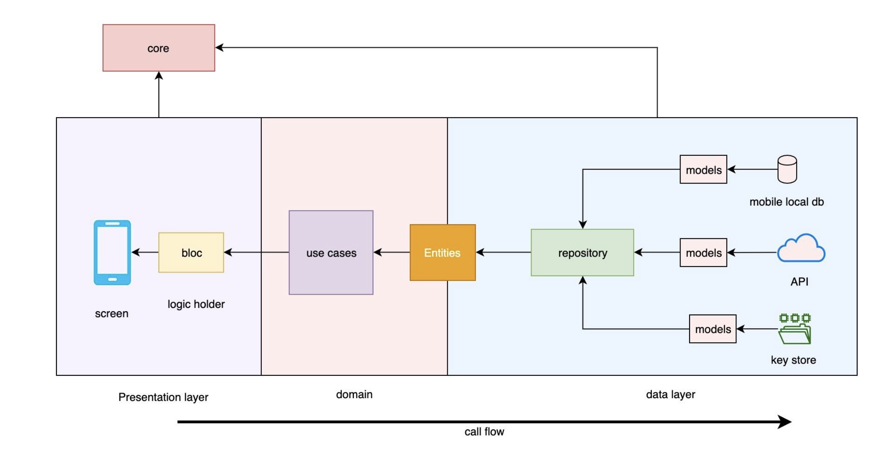

# todo_app

A new Flutter project.

## Screenshots

<br>
<p align="center">


</p>

## Using on this app

- Clean Architecture
- Bloc
- State Management
- Value Equality
- Freezed

## Clean Architecture Diagram



## How to use

To clone and run this application, you'll need [Git](https://git-scm.com/downloads) and [Flutter](https://flutter.dev/docs/get-started/install) installed on your computer. From your command line:

```
# Clone this repository
$ git clone https://github.com/andresroviram/todo_app

# Go into the repository
$ cd todo_app

# Install dependencies
$ flutter pub get

# generate codes
$ dart run build_runner build --delete-conflicting-outputs

# Run the app
$ flutter run
```

